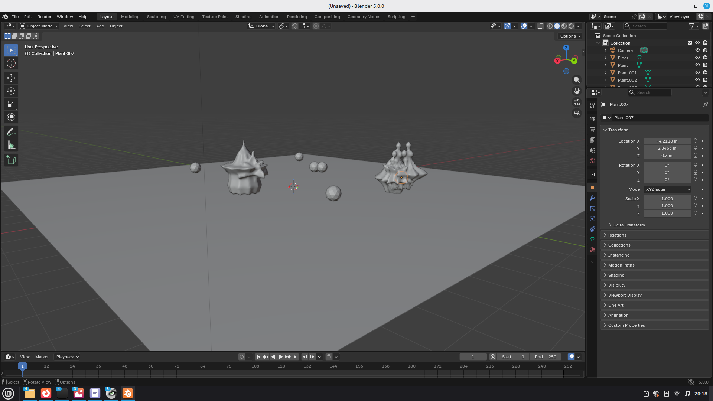

# LAJFI / TRIAD - Evolutionary Life Simulation for Blender

**Procedural creature generation using Gielis superformulas with genetic evolution**

> A Blender Python simulation where organic 3D creatures evolve, reproduce, and export as 3D-printable STL files.



LAJFI is an artificial life simulation that generates organic 3D creatures using the Gielis superformula. Creatures live, eat, reproduce sexually, and die. Their forms evolve over generations through DNA inheritance and mutation. The simulation runs in Blender and exports manifold STL files suitable for 3D printing or glass casting.

## Features

- **Gielis Superformula**: Mathematical generation of organic shapes
- **32-parameter DNA system**: Each creature's form encoded genetically
- **Sexual reproduction**: Offspring inherit mixed DNA from two parents
- **Mutation**: 20% chance per gene, creating variation
- **Natural selection**: No explicit fitness function - survival drives evolution
- **Swedish naming**: Creatures get pronounceable names (BOKA, GLIF, ZOMPA)
- **STL export**: Automatic export of successful creatures for fabrication

## Quick Start

```bash
# Clone
git clone https://github.com/jinkieyz/lajfi.git
cd lajfi

# Run (requires Blender)
./lajfi.sh --gui    # With Blender GUI
./lajfi.sh          # Background mode
```

Or manually in Blender:
1. Open Blender → Scripting workspace
2. Open `run.py`
3. Click **Run Script**

## The Gielis Superformula

The superformula was introduced by Johan Gielis in 2003 as a generalization of the superellipse. It can describe a wide variety of natural and abstract shapes using a single equation.

### Mathematical Form

In polar coordinates:

```
r(θ) = [ |cos(mθ/4)|^n₂ + |sin(mθ/4)|^n₃ ]^(-1/n₁)
```

### Parameters

| Parameter | Effect |
|-----------|--------|
| **m** | Symmetry - number of rotational repetitions (lobes) |
| **n₁** | Overall roundness - smaller values create more angular shapes |
| **n₂** | Shape of "positive" lobes (cosine term) |
| **n₃** | Shape of "negative" lobes (sine term) |

### 3D Extension

For three-dimensional shapes, we use the **spherical product** of two superformulas:
- One superformula controls the shape along **longitude** (θ, 0 to 2π)
- Another controls the shape along **latitude** (φ, 0 to π)

The combined radius at any point on the surface:
```
r(θ, φ) = r₁(θ) × r₂(φ)
```

This technique can generate spheres, stars, flowers, shells, and countless organic forms.

### Examples of Natural Shapes

The superformula can approximate many biological forms:
- **m=5, n₁=0.3**: Starfish
- **m=3, n₁=0.5**: Triangular shell
- **m=0, n₁=1**: Sphere/ellipsoid
- **m=6, n₁=0.2**: Hexagonal crystal

## Project Structure

```
lajfi/
├── run.py              # Entry point - run this with Blender
├── lajfi.sh            # Shell script launcher
├── lajfi/              # Main package
│   ├── __init__.py
│   ├── config.py       # All tunable parameters
│   ├── gielis.py       # Superformula implementation
│   ├── dna.py          # Genetics system
│   ├── creature.py     # Creature class (TriadCreature)
│   ├── plant.py        # Food source
│   ├── world.py        # Simulation loop
│   ├── main.py         # Startup and initialization
│   └── utils.py        # Logging utilities
├── examples/
│   ├── images/         # Screenshots
│   └── stl/            # Example exported creatures
└── output/             # Your STL exports go here
```

## TRIAD Architecture

Each creature is composed of **three overlapping Gielis supershapes** (hence "TRIAD"), plus recursive fractal outgrowths.

```
CREATURE
│
├── Gielis Form 1 (primary body)
│      └── 8 parameters
│
├── Gielis Form 2 (secondary, offset)
│      └── 8 parameters
│
├── Gielis Form 3 (tertiary, offset)
│      └── 8 parameters
│
├── Fractal Genes
│      ├── levels (2-3)
│      ├── children per level (2-5)
│      └── scale factor (0.45-0.70)
│
└── Behavior Genes
       └── speed (0.2-0.5)
```

**Total: 32 DNA parameters**

## DNA System

### Inheritance

When two creatures mate:
1. **Gielis genes**: Randomly selected from one parent (complete gene)
2. **Integer genes**: Randomly selected from one parent
3. **Float genes**: Interpolated between parents (30-70% mix)

### Mutation

Each gene has a 20% chance of mutation:
- **Symmetry (m)**: ±2 discrete steps
- **Shape parameters**: ±25% continuous change
- **Fractal levels**: ±1 step
- **Speed**: ±25% continuous change

### Natural Selection

There is **no explicit fitness function**. Selection emerges from:
1. **Survival**: Creatures that find food live longer
2. **Reproduction**: Creatures with energy can mate
3. **Competition**: Limited resources create competition

Forms that happen to be efficient at survival propagate their genes.

## Creature Names

Creatures are given procedurally generated names following **Swedish phonetic patterns**. Names alternate between consonants and vowels, creating pronounceable syllables:

- **BOKA**, **GLIF**, **ZOMPA**, **NELA**, **TOVA**

This makes every creature's name feel like a real Scandinavian word.

## Installation

### Requirements

- [Blender](https://www.blender.org/) 3.0 or later (tested with 4.0)
- Python 3.10+ (included with Blender)

### Setup

1. Clone this repository:
   ```bash
   git clone https://github.com/jinkieyz/lajfi.git
   cd lajfi
   ```

2. Set your output directory (choose one):
   ```bash
   # Option A: Environment variable
   export LAJFI_OUTPUT="/path/to/your/stl/output"

   # Option B: Edit lajfi/config.py directly
   # Look for "HEY CUTIE" comment :)
   ```

3. Run:
   ```bash
   ./lajfi.sh --gui    # With Blender interface
   ./lajfi.sh          # Background mode (headless)
   ```

   Or open Blender manually:
   - Go to **Scripting** workspace
   - Open `run.py`
   - Click **Run Script**

## Configuration

Edit `lajfi/config.py` to tune the simulation:

```python
MAX_CREATURES = 3          # Population limit
MAX_PLANTS = 8             # Food sources
MUTATION_RATE = 0.20       # 20% mutation chance
EXPORT_INTERVAL = 120      # Seconds between exports
```

## Output

STL files are saved to `OUTPUT_DIR` (default: `./output/`) with naming convention:
```
lajfi_{NAME}_gen{GENERATION}_{TIMESTAMP}.stl
```

Example: `lajfi_BOKA_gen3_20260126_213653.stl`

## Examples

### Exported Creatures

The `examples/stl/` directory contains sample creatures:

| File | Description |
|------|-------------|
| `triad_REKAN_gen1_20260126_213653.stl` | First generation creature |
| `triad_TRIAD_GAMMA_20260122_224449.stl` | Early simulation run |

### Screenshots

See `examples/images/` for screenshots of the simulation in action.

## Fabrication

The exported STL files are **manifold** (watertight) thanks to Blender's voxel remesh, making them suitable for:

- **3D printing**: FDM, SLA, SLS
- **CNC milling**: For mold making
- **Glass casting**: Create plaster-silica molds from 3D prints

### Recommended Workflow for Glass

1. Export STL from simulation
2. 3D print in PLA or resin
3. Create silicone mold from print
4. Cast wax positive from silicone
5. Create plaster-silica investment mold
6. Cast glass using lost-wax technique

## Technical Details

### Mesh Generation

1. **Vertex generation**: Spherical sampling with superformula radii
2. **Face generation**: Quad mesh connecting adjacent vertices
3. **Fractal recursion**: Child shapes placed at parent vertices
4. **Boolean union**: All parts joined into single mesh
5. **Voxel remesh**: Creates manifold mesh (0.05 voxel size)

### Performance

On an NVIDIA GTX 1660 SUPER:
- Creature generation: ~2-3 seconds
- Simulation tick: ~0.3 seconds
- STL export: ~1 second

Memory usage scales with `fractal_levels` and `fractal_children`.

## References

### Primary Source

**Gielis, J.** (2003). A generic geometric transformation that unifies a wide range of natural and abstract shapes. *American Journal of Botany*, 90(3), 333-338.
https://doi.org/10.3732/ajb.90.3.333

### Additional Reading

**Gielis, J.** (2017). *The Geometrical Beauty of Plants*. Atlantis Press.
https://doi.org/10.2991/978-94-6239-151-2

**Weisstein, E. W.** "Superellipse." From *MathWorld*--A Wolfram Web Resource.
https://mathworld.wolfram.com/Superellipse.html

**Wikipedia contributors.** "Superformula." *Wikipedia, The Free Encyclopedia*.
https://en.wikipedia.org/wiki/Superformula

### Related Work

**Sims, K.** (1994). Evolving virtual creatures. *SIGGRAPH '94: Proceedings of the 21st annual conference on Computer graphics and interactive techniques*, 15-22.
https://doi.org/10.1145/192161.192167

**Stanley, K. O., & Miikkulainen, R.** (2002). Evolving Neural Networks through Augmenting Topologies. *Evolutionary Computation*, 10(2), 99-127.
https://doi.org/10.1162/106365602320169811

**Dawkins, R.** (1986). *The Blind Watchmaker*. W. W. Norton & Company.
(Inspiration for evolutionary art systems)

## License

MIT License

Copyright (c) 2026 Nadeschda Barenje Lindgren

Permission is hereby granted, free of charge, to any person obtaining a copy
of this software and associated documentation files (the "Software"), to deal
in the Software without restriction, including without limitation the rights
to use, copy, modify, merge, publish, distribute, sublicense, and/or sell
copies of the Software, and to permit persons to whom the Software is
furnished to do so, subject to the following conditions:

The above copyright notice and this permission notice shall be included in all
copies or substantial portions of the Software.

THE SOFTWARE IS PROVIDED "AS IS", WITHOUT WARRANTY OF ANY KIND, EXPRESS OR
IMPLIED, INCLUDING BUT NOT LIMITED TO THE WARRANTIES OF MERCHANTABILITY,
FITNESS FOR A PARTICULAR PURPOSE AND NONINFRINGEMENT. IN NO EVENT SHALL THE
AUTHORS OR COPYRIGHT HOLDERS BE LIABLE FOR ANY CLAIM, DAMAGES OR OTHER
LIABILITY, WHETHER IN AN ACTION OF CONTRACT, TORT OR OTHERWISE, ARISING FROM,
OUT OF OR IN CONNECTION WITH THE SOFTWARE OR THE USE OR OTHER DEALINGS IN THE
SOFTWARE.

## Author

**Nadeschda Barenje Lindgren**
- Website: [vetroal.se](https://vetroal.se)
- Email: auspekzer@gmail.com
- Program: Glass & Ceramics, Konstfack University of Arts, Crafts and Design

This project is part of the **IN SILICO** thesis project (2026), exploring the intersection of generative algorithms and physical glass sculpture.

## Contributing

Contributions are welcome! Please feel free to submit issues or pull requests.

Areas of interest:
- Performance optimizations
- New DNA parameters
- Alternative superformula variants
- Visualization improvements
